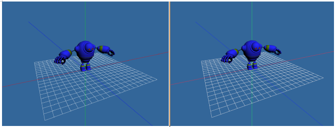
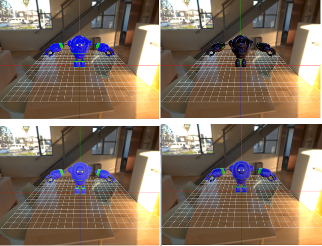
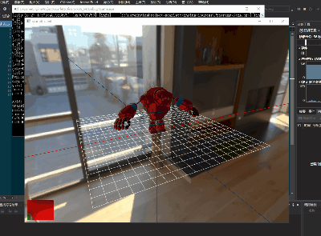
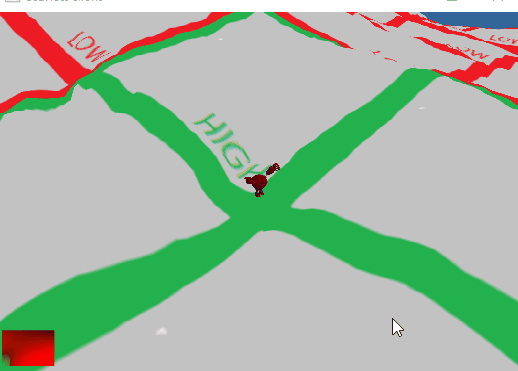
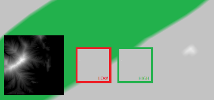
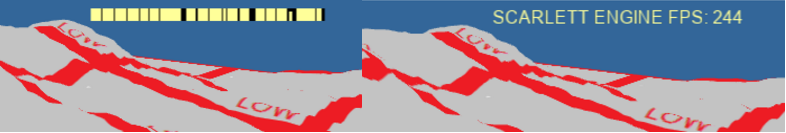

# scarlett
A Simple Game Engine Project

# depends
+	Assimp: https://github.com/assimp/assimp
+	Boost: https://www.boost.org/
+	FreeType: https://www.freetype.org/index.html

## updated in 2019/12/6
+	esc framework.

+	basic cross-platform rendering.(dx11, opengl)

+	pbr workflow.

+	basic animation system.

+	basic terrain system.

## updated in 2019/12/11
+	ui framework.

+	basic ttf fone render.

