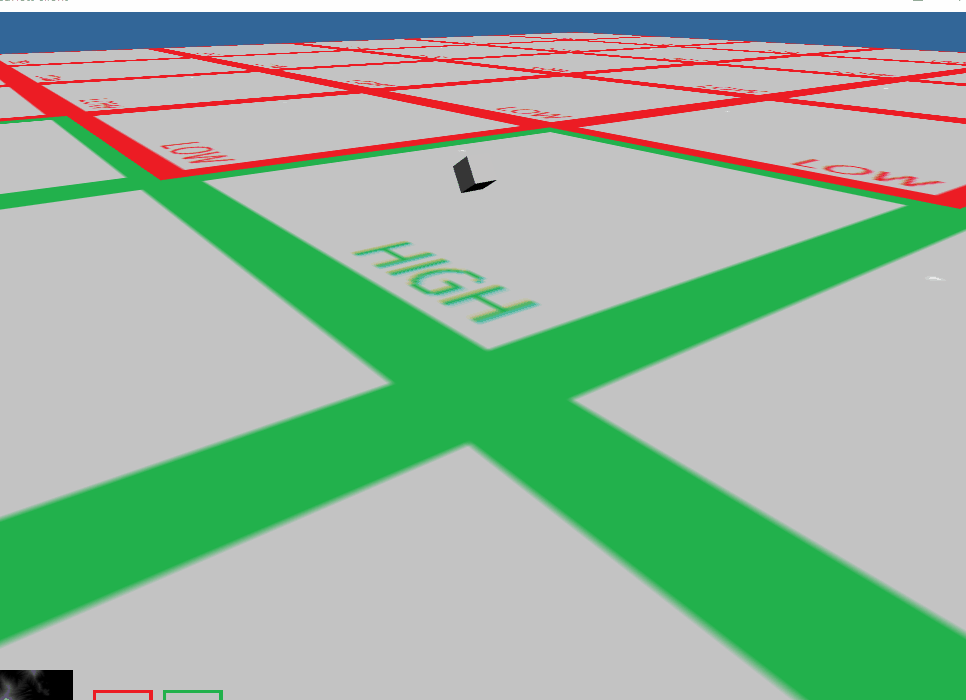

# scarlett
A Simple Game Engine Project


# depends
+	Assimp: https://github.com/assimp/assimp
+	Boost: https://www.boost.org/
+	FreeType: https://www.freetype.org/index.html

# How to run?
+ if you use VS2017

you can run this project by following command:
```
git clone https://github.com/xiaoshichang/scarlett.git
cd scarlett
git submodule init
git submodule update
```
then open this project with VS2017, build it and run it.

+ if you use other version of VS

you need to complie all used libraries by youself and modify the paths in `CMakelist.txt` files.


## updated in 2019/12/6
+	esc framework.

+	basic cross-platform rendering.(dx11, opengl)


+	pbr workflow.


+	basic animation system.


+	basic terrain system.


## updated in 2019/12/11
+	ui framework.


+	basic ttf font render.


## updated in 2021/1/12
+   basic physics system.

